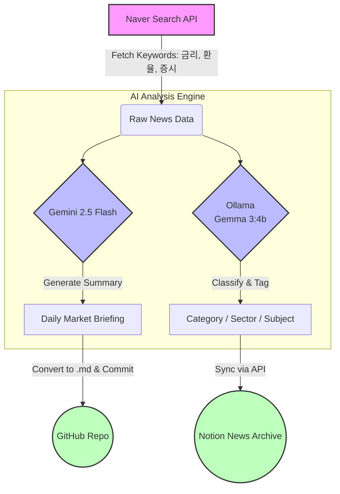

# 📈 Financial News Automation System (FNAS)

**FNAS**는 금융 시장 뉴스를 자동으로 수집하고, AI를 통해 분석하여 **Notion 데이터베이스**와 **GitHub**에 리포트 형태로 아카이빙하는 자동화 시스템입니다.


## 🍀 Introduction

* 우리가 흔히 구독하는 종이신문,전자신문 등은 신문에 표시되어 있는 날짜가 아닌, 그 전날 밤까지의 뉴스가 담긴다. 신문이 작성되고, 만들어져서 배급되는 데까지 일종의 **갭(Gap)** 이 존재하는 것이다. 따라서 **FNAS**는 해당 날짜의 이슈를 확인하기 위해 **한국 기준 아침 8시**에 뉴스 기사를 수집하고, AI를 통해 **"Daily Market Briefing"** 을 작성하여 기존의 신문과 **상호보완적** 역할을 수행하도록 한다. 

* 수집한 뉴스기사들의 **Category,Subject,Sector**를 AI로 분류하여, Notion Database에 저장하는 **Archive** 역할을 수행한다. 그 후에 Notion에서의 정렬을 통해, 원하는 대상에 대한 **Research**를 돕는다.


## 🔄 Automated Workflow

### 1. Data Collection
* **뉴스 자동 수집**: Naver Search API를 활용하여 주요 금융 키워드(금리, 환율, 증시) 관련 최신 뉴스를 실시간으로 수집합니다.

### 2. AI Analysis
* **Daily Market Briefing 생성**: Google **Gemini 2.5 Flash** 모델을 활용하여 수집된 뉴스를 바탕으로 '오늘의 시황 브리핑'을 자동으로 작성합니다.
* **AI 기반 뉴스 분류**: 로컬 LLM인 **Ollama (Gemma 3:4b)** 를 활용하여 뉴스의 Subject, Category, Sector(Category가 Company일 경우)를 정밀하게 분류하고 영문 태깅을 수행합니다.

### 3. Data Archiving
* **Notion 자동 동기화**: 수집된 뉴스기사들을 **Notion API**를 통해 News_Archive Database에 저장합니다.
* **GitHub 리포트 발행**: 생성된 브리핑 리포트를 Markdown 파일로 변환하여 GitHub 레포지토리에 자동 커밋합니다.



## 📂 Project Structure

```bash
├── Daily_reports/      # Daily Market Briefing 저장 폴더
├── .gitignore          # Git 제외 파일 목록
├── classifier.py       # Ollama를 이용한 뉴스 분류 및 분석
├── main.py             # 프로그램 진입점 (Orchestrator)
├── requirements.txt    # 의존성 라이브러리 목록
├── scraper.py          # 네이버 뉴스 수집 및 Gemini 브리핑 생성
└── uploader.py         # Notion 및 GitHub 업로드 처리
